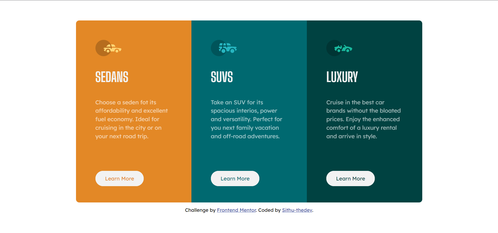

# Frontend Mentor - 3-column preview card component solution

This is my solution to the [3-column preview card component challenge on Frontend Mentor](https://www.frontendmentor.io/challenges/3column-preview-card-component-pH92eAR2-). Frontend Mentor challenges help you improve your coding skills by building realistic projects.

## Table of contents

- [Overview](#overview)
  - [The challenge](#the-challenge)
  - [Built with](#built-with)
  - [My Solution](#my-solution)
  - [Links](#links)
- [Author](#author)

**Note: Delete this note and update the table of contents based on what sections you keep.**

## Overview

### The challenge

Users should be able to:

- View the optimal layout depending on their device's screen size
- See hover states for interactive elements

### Built with

- HTML
- CSS
- Bootstrap-5

### My Solution

### Links

- Solution URL: [CLICK HERE](https://www.frontendmentor.io/solutions/3columnpreviewcardcompoentwithbootstrap5--782RHEsl4)
- Live Site URL: [CLICK HERE](https://3-column-preview-card-by-sithu-thedev.netlify.app/)

## Author

- Website - [Sithu Aung Khant](https://www.your-site.com)
- Frontend Mentor - [@Sithu-Aung-Khant](https://www.frontendmentor.io/profile/Sithu-Aung-Khant)
- Twitter - [@Sithu_AungKhant](https://twitter.com/Sithu_AungKhant)
